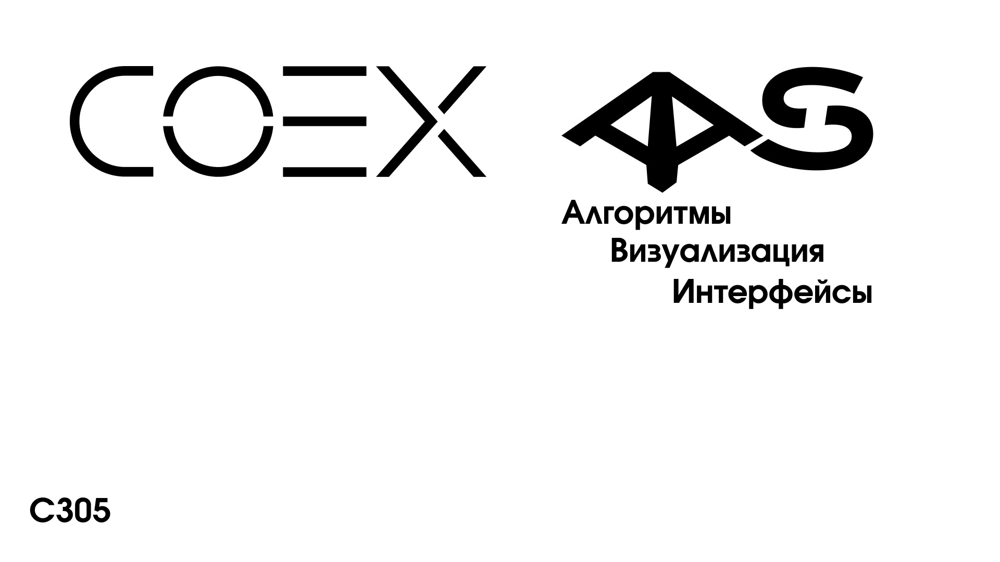

# Система автоматического измерения и анализа воздуха (Air Analisys System)

## Введение

Мы команда студентов, представляющая центр проектной деятельности Дальневосточного федерального университета(C305) в ходе работы над проектом участвующем в соревнованиях Copterhack 2022, разработали автономную систему мониторинга воздуха, на базе квадрокоптера COEX Clever 4.

### Состав команды

* [Мамбетов Руслан](https://github.com/Ruslan2288) - CEO, разработчик встраиваемого ПО, дизайнер печатной платы;
* [Филимонов Сергей](https://github.com/Lukerrr) - программист (интерфейс пользователя, визуализатор);
* [Смадыч Никита](https://github.com/NikitaS2001) - инженер-программист (навигация дрона);
* Антонов Георгий  - инженер (сборка и настройка дрона, создание 3d моделей).

## Презентационный ролик

## Документация к проекту

* [Сборка коптера газоанализатора](/docs/drone_assembly.md)
* [Настройка коптера для автономных полётов](/docs/drone_config.md)
* [Система планирования полета](/docs/path_planning.md)
* [Пользовательские приложения](/docs/user_applications.md)
* [Настройка лидара](/docs/setup_lidar.md)
* [Процесс загрузки прошивки](/docs/firmware_upload.md)
* [Подключение датчиков газов](/docs/gas_sensors.md)
