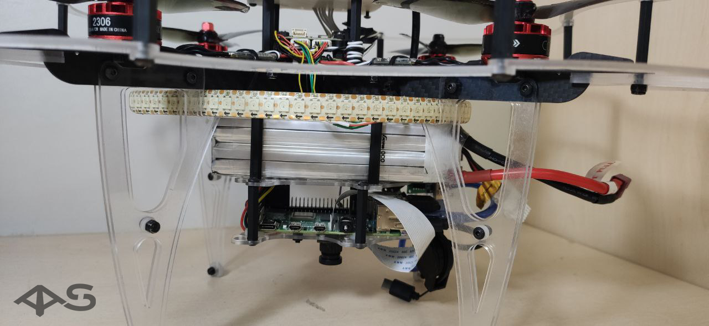
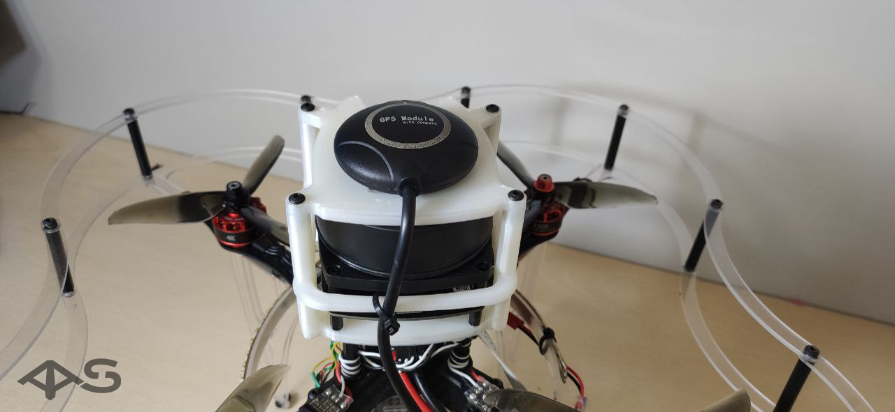
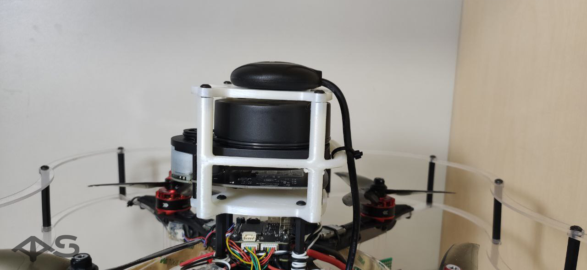
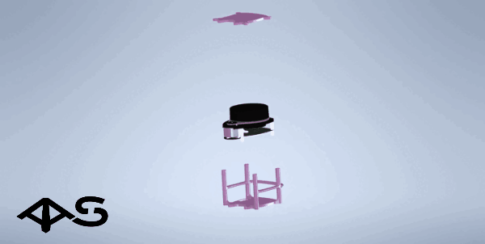
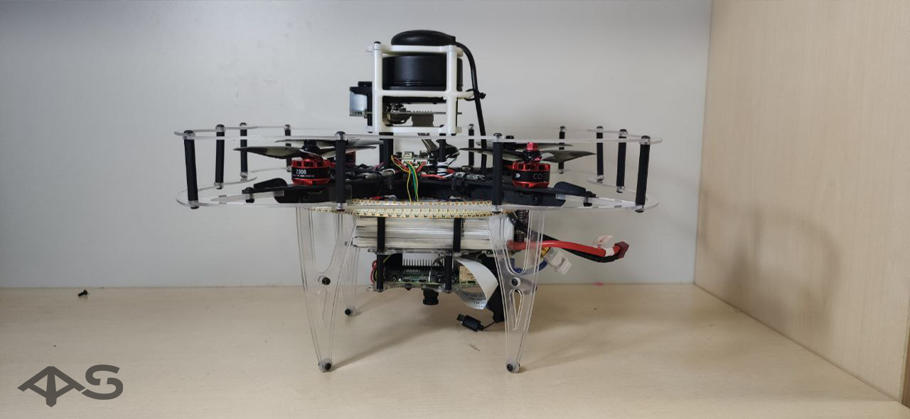

# Сборка коптера газоанализатора

Для использования всех необходимых компонентов стандартная сборка клевера была пересобрана:

1. Батарейный отсек был перемещён под Х образную раму, а под ним установлены Raspberry Pi, камера, лазерный дальномер и плата газоанализатора.

2. Защита для лидара устанавливается на вместо стандартной деки для АКБ на более длинные стойки.

    

    На верхнюю крышку защиты лидара устанавливается модуль GPS.

    

3. Сборка защиты лидара

    

Подключение модуля GPS производится [стандартным образом](https://clover.coex.tech/ru/gps.html).

Подключение лидара и газоанализатора к Raspberry Pi производится через USB порты.

В итоговом варианте собранный коптер выглядит так:

