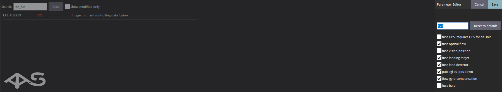

# Настройка коптера для автономных полётов

Для использования автономных полётов с системой газоанализации и возможностью детектирования и облёта препятствий необходимы:

1. [Первоначальная настройка коптера](https://clover.coex.tech/ru/setup.html).

2. [Настройка модуля GPS](https://clover.coex.tech/ru/gps.html).

3. [Настройка Optical Flow](https://clover.coex.tech/ru/optical_flow.html).

После успешного выполнения всех настроек остаётся только выбрать, где будут производиться полёты (в помещении или на улице), а после включить флаги в параметре lpe_fusion как на изображении ниже.

## Параметры для полётов в помещении (indoor)

## Параметры для полётов на улице (outdoor)

