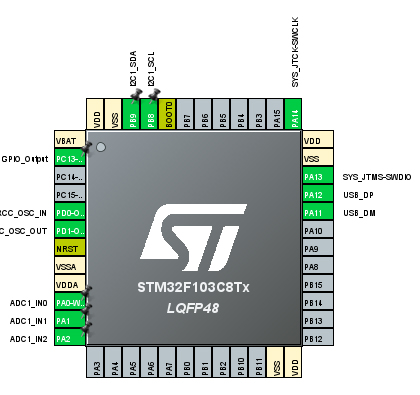
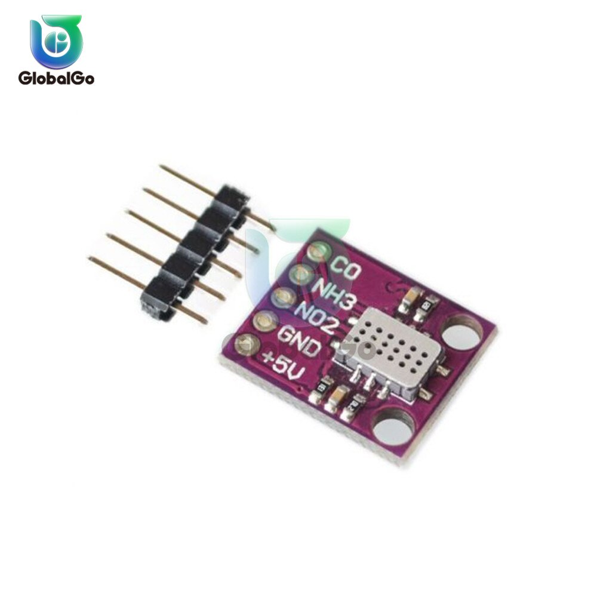

# Подключение датчиков газов

Для того, чтобы получать данные с датчиков HDC1080 и CCS811, необходимо подключить их к шине интерфейса I2C(SDA-A4, SCL-A5). Для удобства можно [приобрести](https://aliexpress.ru/item/4000158815164.html?sku_id=10000000503028085&spm=a2g39.orderlist.0.0.1ac24aa6mchzmR) готовый модуль, содержащий на борту эти датчики.

## ВАЖНО! - Для данных датчиков необходимо питание 3.3 вольта


Подкючение датчика MICS-6814 осуществляется при помощи 3 проводов, которые подключаются к входам АЦП микроконтроллера. Принимаемое значение питания датчика - 5 вольт.
Для Arduino Nano эти пины по умолчанию A2, A3, A3:

```cpp
#define PIN_CO  A2
#define PIN_NO2 A3
#define PIN_NH3 A4
```

Для stm32f103 - PA0, PA1, PA2



Готовый модуль с датчиком MICS-6814 также доступен в [продаже](https://aliexpress.ru/item/4000215089588.html?sku_id=10000000835487891&spm=a2g39.orderlist.0.0.1ac24aa6JvT3EL).


