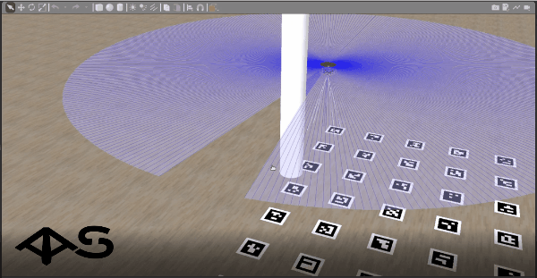

# Система планирования полёта

Возможность возникновения на пути следования дрона различных препятствий (например, высокие здания, башни ЛЭП или иные летательные аппараты) побудила нас разработать специальную систему планирования маршрута полёта. В качестве алгоритма планирования был выбран метод потенциальных полей (МПП), так как он является наиболее простым в реализации и при этом подходящим для использования в открытых пространствах.

Основная суть МПП в том, что целевая точка должна притягивать дрона, а препятствия - отталкивать. В результате работы алгоритма формируется желаемый вектор скорости дрона. Информация о местоположении препятствий находится при помощи лазерного сканера RPLidar, установленном на дроне. Для управления квадрокоптером с учётом препятствий используется дополнительный модуль _smart_nav_, управление дроном при этом производится по скорости с помощью модуля _simple_offboard_.

Пример выполнения полёта с облётом препятствий в симуляторе:

