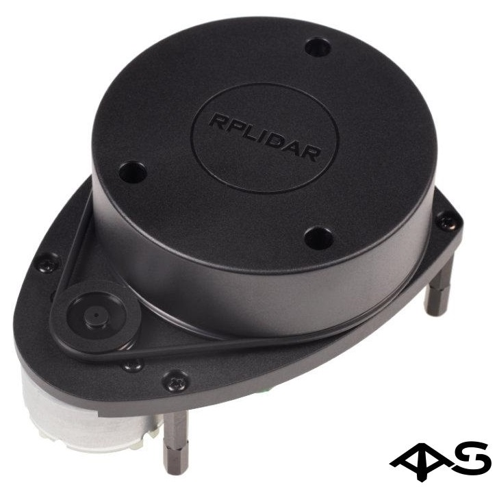

# Настройка лидара

Для системы «Предотвращения столкновений» мы используем **RPLidar A1**. Это самый популярный 2D lidar (далее - лидар) с хорошим соотношением цена/качество. Датчик позволяет получить 360-градусное поле сканирования с частотой обновления от 2 Гц до 10 Гц. Дальность действия лидара составляет около 8 метров. Результатом работы лидара является облако точек, которое используется для облета препятствий.



## Установка и сборка пакета rplidar_ros

1. Клонируем пакет rplidar_ros из github в ~/<your_own_ws>/src:

    ```bash
    git clone https://github.com/Slamtec/rplidar_ros.git
    ```

2. Собираем пакет rplidar_ros:

    ```bash
    cd <your_own__ws>
    catkin_make
    ```  

## Настройка пакета

1. Фиксируем USB порт и добавляем права на запись:

    ```bash
    ~/<your_own__ws>/src/scripts/create_udev_rules.sh
    sudo chmod 666 /dev/rplidar
    ```

2. Изменяем параметры "serial_port" и "frame_id" в файле rplidar_ros/launch/rplidar.launch:

    ```bash
    <param name="serial_port" type="string" value="/dev/rplidar"/>
    <param name="frame_id"    type="string" value="laser_link"/>
    ```
