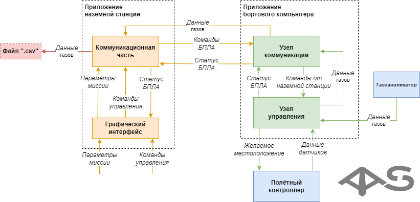
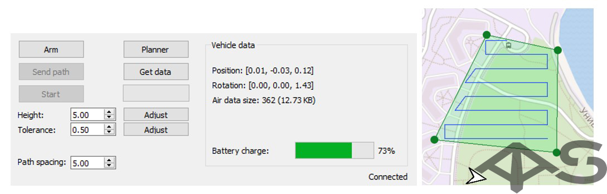
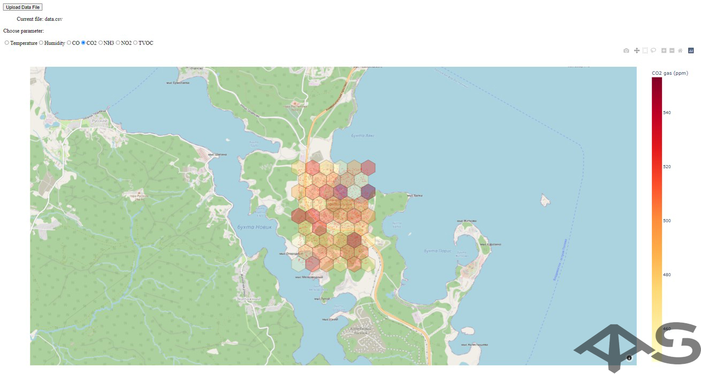

# Пользовательские приложения

Для управления квадрокоптером используется ноутбук (наземная станция) со специальным ПО (приложение наземной станции), которое соединяется с дроном по WiFi. Функциональная схема системы управления выглядит следующим образом:

Полученный .CSV файл можно удобно отобразить в специализированном приложении-визуализаторе. О приложениях наземной станции и визуализаторе будет рассказано далее.

## Приложение наземной станции

Приложение наземной станции предоставляет пользователю возможность настроить миссию БПЛА и связаться с его бортовым компьютером.

Программное обеспечение наземной станции состоит из двух параллельных частей – коммуникатора и графического пользовательского интерфейса.
Приложение реализовано с использованием языка C++11 и библиотеки Qt5.

Коммуникатор осуществляет отправку сообщений на бортовой компьютер и прием сообщений от него. Обмен сообщениями осуществляется по сети Wi-Fi с использованием протокола TCP.

GUI состоит из главного окна взаимодействия с БПЛА и окна планировщика. Окно планировщика содержит интерактивную географическую карту, работающую на основе API «OpenStreetMap».На карте показано местоположение БПЛА, также на карте пользователь может выбрать полигон миссии, внутри полигона автоматически строится траектория движения с регулируемой плотностью.

Используя приложение, пользователь может загрузить данные датчиков воздуха с БПЛА и сохранить их в виде таблицы .CSV.

## Приложение визуализации

Приложение визуализации используется для отображения полученных данных датчиков воздуха (в формате .csv) на географическую карту для дальнейшего ручного анализа. Приложение визуализации реализовано на языке Python3 с использованием библиотек «Plotly» и «Dash».
Данные датчиков визуализируются в виде графика Hexbin, пользователь может переключаться между различными параметрами воздуха и газами.

### Использование

* Установить необходимые для работы библиотеки: pip install numpy pandas plotly dash dash-extensions Werkzeug==2.0.0
* Запустить скрипт для визуализации: python airviz.py
* Открыть в браузере запущенное приложение для визуализации <http://127.0.0.1:8050/>
* Загрузить .CSV файл с данными о газах нажатием на кнопку _Upload Data File_
* Выбрать необходимый для визуализации газ из списка: _Temperature, Humidity, CO, CO2, NH3, NO2, TVOC_
